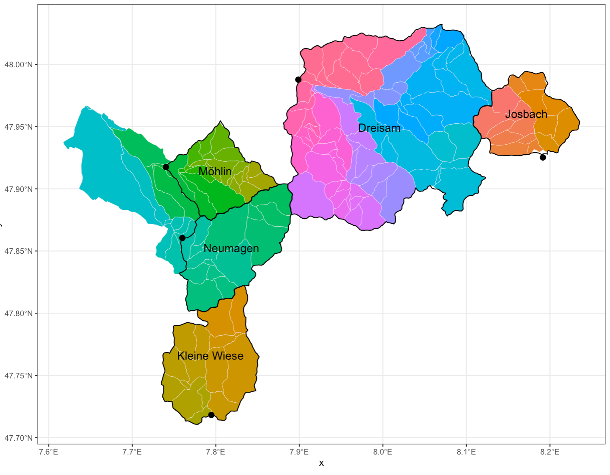
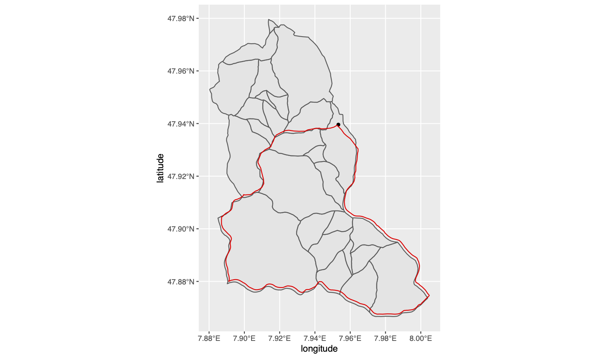

# basinbindr

<!-- badges: start -->

<!-- badges: end -->

The goal of basinbindr is to delineation catchment boundaries based on gauging station locations.

Catchment delineation is creates a boundary that represents the contributing area for a specific water outlet, with the intent of characterization and analysis a specifc area, i.e. the topographic catchment boundaries.

## Installation

You can install the development version of basinbindr from [GitHub](https://github.com/) with:

``` r
# install.packages("devtools")
devtools::install_github("modche/basinbindr")
```

## Examples




Here for a single catchment:


